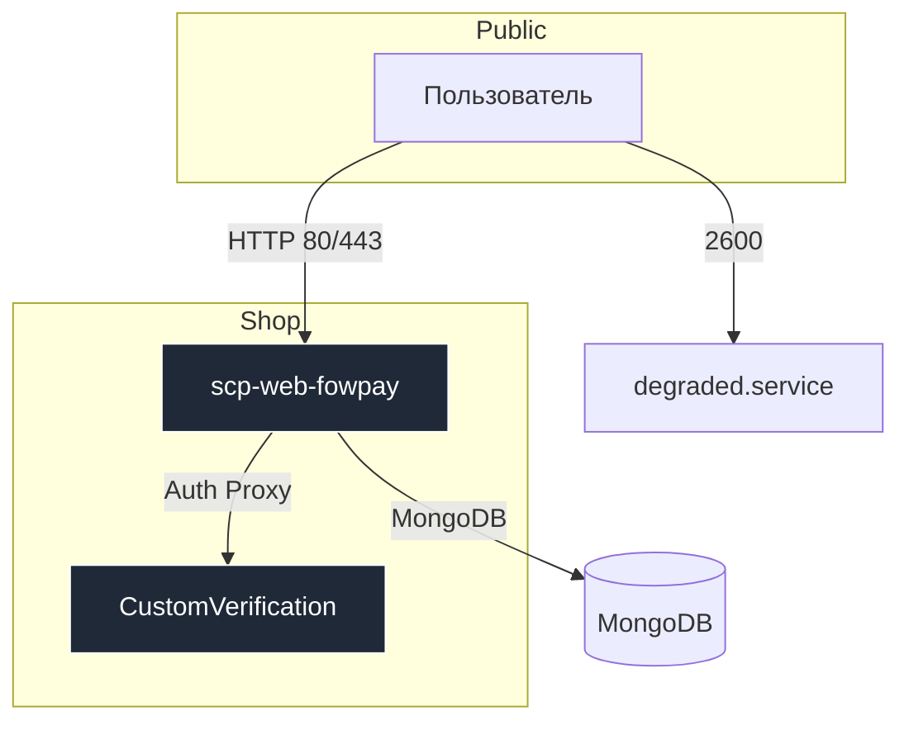

# scpsl‑shop‑old‑web 🛒🕸️ (2020‑2022 archive)

> **scpsl‑shop‑old‑web** — мой первый продакшен‑сайт‑магазин, запущенный в 2020 году и бесперебойно работавший более пяти лет.
> В этом репозитории сохранена **архивная версия на конец 2022‑го**; развитие продлилось до Q1 2023, после чего проект был полностью заморожен. Код доступен «как есть» — без поддержки и новых релизов.

---

## 📂 Состав репозитория

| Директория               | Стек / язык                                | Назначение                                                                                                             |
| ------------------------ | ------------------------------------------ | ---------------------------------------------------------------------------------------------------------------------- |
| **`CustomVerification`** | **Node.js** (`express`, `node-fetch`)      | Проксирует обращение к `authenticator.php`, распределяя трафик между несколькими IP серверов, подменяет порты и ключи. |
| **`archive-scripts`**    | **Node.js**                                | Исторические одноразовые скрипты; в том числе `yoomoney-pay.js`, создающий автопереход на форму Yoomoney QuickPay.     |
| **`degraded.service`**   | **Node.js** (`fastify`, `ejs`)             | Лёгкий статический сайт «Сервисы недоступны» с кастомными курсорами и авто‑404, поднимается на `127.0.0.1:2600`.       |
| **`scp-web-fowpay`**     | **Node.js** (`express`, `mongoose`, `ejs`) | Главный монолит магазина и дашборда: REST‑API, обработка платежей, Steam/Discord OAuth, кланы, кастомизации.           |
| └ **`base`**             | Mongoose ODM                               | Все схемы MongoDB: аккаунты, роли, достижения, визуалы, кланы, статистика и прочее.                                    |
| └ **`dashboard`**        | Express + статические ресурсы              | Клиентские шаблоны, кастомные курсоры, изображения, роуты `/profile`, `/clans`, `/community`, WebSocket‑подписки.      |
| **`LICENSE`**            | MIT                                        | Условия распространения ПО.                                                                                            |

---

## 🚀 Быстрый старт (локально)

> Требуется **Node.js 18+** и запущенный **MongoDB 6+**.

```bash
# 1. Клонируйте репозиторий
$ git clone https://github.com/Shiro-nn/scpsl-shop-old-web-2020-2022.git
$ cd scpsl-shop-old-web-2020-2022

# 2. Запустите нужный сервис

## CustomVerification (порт 4639)
$ cd CustomVerification && npm i && node app.js

## degraded.service (порт 2600)
$ cd ../degraded.service && npm i && node init.js

## Магазин + дашборд (порт 2631, проксируется на 80 при testing=true)
$ cd ../scp-web-fowpay && npm i && node index.js  # или pm2 по вкусу
```

Переменные окружения для магазина настраиваются в `scp-web-fowpay/config.js` (Mongo URI, Steam API‑key, токены, домен CDN и прочее).

---

## 🧩 Мини‑архитектура



---

## 🛠️ Системные требования

* **Node.js 18+**
* **MongoDB 6+** (реплика не обязательна)
* **PM2** (рекомендовано для production)
* Домен с SSL (магазин предполагает работу по HTTPS)

---

## 🤝 Вклад

Репозиторий **заморожен** — пул‑реквесты принимаются только на критические баг‑фиксы или безопасность. Форкайте и экспериментируйте свободно.

---

## ⚖️ Лицензия

Код распространяется под лицензией **MIT**. См. файл [`LICENSE`](LICENSE) для подробностей.

> Спасибо за интерес к историческому коду! Надеюсь, наработки пригодятся вам в учёбе или экспериментах.
